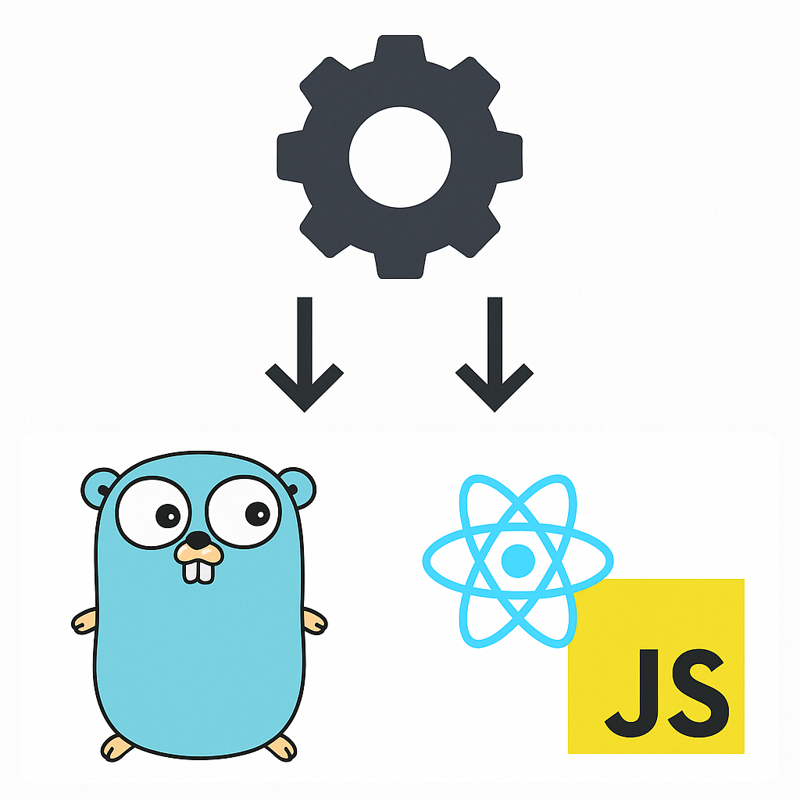

## *F*ull *S*tack *F*ramework

**fsf** is a statically typed programming language and framework for building full stack applications that are server
side rendered and
hydrated on the client.
It is heavily inspired by Rust and NextJS.

Like Rust, fsf is an expression oriented language and, unlike Rust, html elements appear as first class expressions.
For example, a simple counter app can be created by running `fsf serve` on the following code:

```
import std::react::use_state;

cmpnt Index() {
    let (count, set_count) = use_state(0);

    <div>
        <span>`Count: {count}`</span>
        <button onclick={|| set_count(count + 1)}>"increment"</button>
    </div>
}
```

To achieve this, fsf is compiled to Go code on the backend and React + JavaScript on the frontend. The Go backend serves
the HTML and the relevant JavaScript to hydrate the UI with React on the client.



## Design Goals

fsf is designed to be fun and familiar. Developer experience and ergonomics is the highest priority. By leveraging React
Server Components
and React under the hood developers can develop their full stack applications rapidly while being able to tap into the
existing React ecosystem.

The language takes inspiration from Rust for its expressiveness and ergonomics. fsf leverages ownership to develop clean
APIs and remove whole classes of bugs. fsf is garbage collected which keeps the code readable and familiar (no
lifetimes) to most
developers.

By compiling to Go on the backend we can take advantage of Go's rapid compile time and existing ecosystem. It's a design
goal to be able to seamlessly drop in fsf into an existing Go codebase with bidirectional interoperability. This will
help enable widespread adoption and because of ownership semantics we will be able to remove bugs that typically [plague
Go codebases](https://www.uber.com/en-GB/blog/data-race-patterns-in-go/).

In addition, fsf is aimed to be batteries included to develop full stack applications. For this, we will take
inspiration from frameworks like Rails and Laravel to provide components like auth, async queues, mail and so on.

It is hoped that fsf will spark joy in developers creating full stack applications.

## Roadmap

1. Flesh out language primitives (structs, enums, pattern matching)
2. Add static type checking
3. Add ownership semantics
4. Robust routing for multipage applications
5. Simplify distribution and getting started
6. Implement basic LSP functionality
7. Add 'quickstart' to get started with a full application including auth
